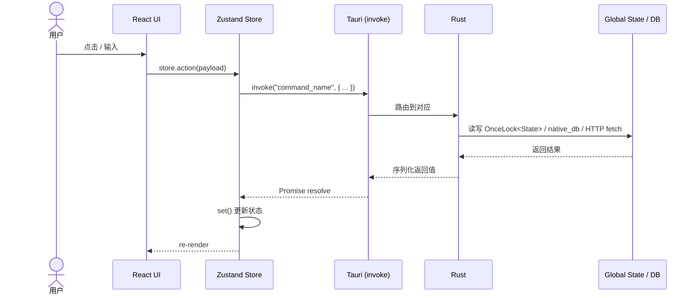
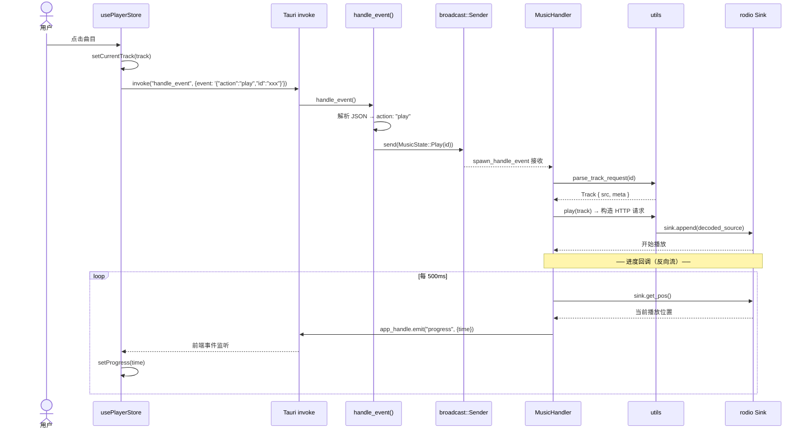
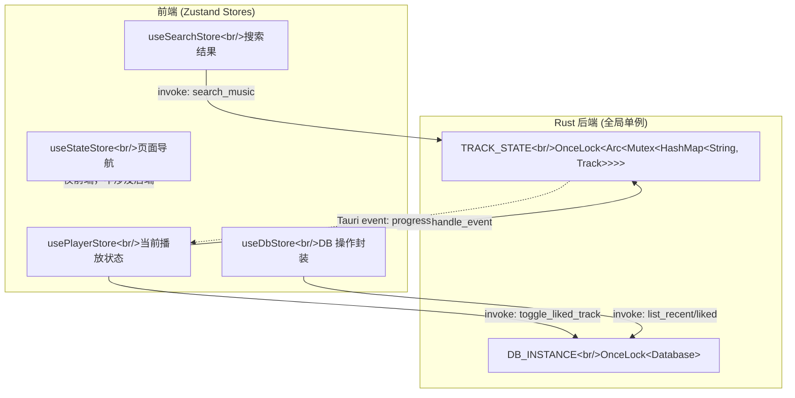

# Architecture: music_demo

> 持久基准文档。所有 `specs/<feature>/plan.md` 的 Technical Context 段落直接引用本文。
> 随项目演进更新；与具体功能需求解耦。

**最后更新**: 2026-06-30 (音频问题归档，路由修复)

---

## 1. 技术栈

| 层 | 技术 | 版本 |
|---|---|---|
| 桌面壳 | Tauri v2 | `2.9.x` |
| 前端框架 | React + TypeScript | `19.x` / `5.9.x` |
| 构建 | Vite | `7.x` |
| 样式 | Tailwind CSS | `4.x` |
| 状态管理 (FE) | Zustand | `5.x` |
| 路由 | react-router-dom | `7.x` |
| Rust edition | 2021 | — |
| 数据库 | native_db (SQLite) | `0.8.x` |
| 音频播放 | rodio (Symphonia 解码) | `0.21.x` |
| HTTP 客户端 (Rust) | reqwest | `0.12.x` |
| HTML 解析 | scraper | `0.25.x` |
| 序列化 | serde / serde_json | `1.x` |

---

## 2. 目录结构

```
src/                          # 前端 (React + TS)
├── main.tsx                  # 入口
├── App.tsx                   # 根组件（当前简化：直接渲染 TrackList）
├── components/               # 可复用 UI 组件
│   ├── MiniPlayer.tsx        #   迷你播放器（核心复杂度）
│   ├── TrackCard.tsx         #   曲目卡片
│   ├── TrackLibrary.tsx      #   曲库列表
│   ├── MainPageContent.tsx   #   主页内容布局
│   ├── SearchBar.tsx         #   搜索栏
│   ├── SearchContent.tsx     #   搜索结果
│   ├── TrackPage.tsx         #   曲目详情
│   └── ParseUrl.tsx          #   URL 解析输入
├── features/                 # 功能组合层（组装 components + store）
│   └── TrackLists.tsx        #   播放列表功能
├── pages/                    # 页面级组件
│   ├── MainPage.tsx
│   ├── TrackPage.tsx
│   └── SearchPage.tsx
├── layout/
│   └── MainLayout.tsx
├── hooks/                    # 自定义 hooks
│   ├── playHooks.ts
│   └── TrackLists.ts
├── store/                    # Zustand 状态管理
│   ├── Player.ts             #   播放状态（当前曲目、播放/暂停、进度）
│   ├── Db.ts                 #   数据库操作状态
│   ├── Search.ts             #   搜索状态
│   └── State.ts              #   页面导航状态
├── services/                 # 前端服务层（封装 Tauri invoke）
│   ├── dbServices.ts
│   ├── searchService.ts      #   (空壳)
│   └── playerService.ts      #   (空壳)
├── types/                    # 前端类型定义
│   ├── track.ts              #   Track 接口
│   ├── player.ts             #   PlayerState
│   └── state.ts              #   ContentState / StateEnum
└── platform/                 # 平台抽象层（预留，未激活）
    ├── types.ts
    ├── desktop/
    └── mobile/

src-tauri/                    # Rust 后端
├── Cargo.toml
├── tauri.conf.json
└── src/
    ├── main.rs               # 入口
    ├── lib.rs                # Tauri Builder + command 注册
    ├── global.rs             # 全局状态：DB 实例 + TrackState
    ├── types.rs              # Track, TrackMeta, TrackView, TrackSrc, MetaValue
    ├── storage.rs            # native_db 模型 + CRUD 操作
    ├── public.rs             # 公开 Tauri commands（list/toggle）
    ├── music_handler/        # 音频播放控制
    │   ├── mod.rs
    │   ├── handler.rs        #   MusicHandler: rodio Sink + broadcast channel
    │   ├── publics.rs        #   handle_event Tauri command (前端→后端入口)
    │   └── utils.rs          #   播放/解析辅助
    └── music_fetch/          # 外部音乐源抓取
        ├── mod.rs
        ├── wx.rs             #   微信公众号文章音频解析
        └── bilibili/         #   B站搜索 + 音频提取
            ├── mod.rs
            ├── types.rs
            ├── search.rs
            └── utils.rs
```

---

## 3. 运行时流程

### 3.1 整体数据流



### 3.2 播放链路



### 3.3 状态架构



**Rust 全局单例**:
- `TRACK_STATE`: 以 UUID 为 key 缓存所有已加载曲目
- `DB_INSTANCE`: native_db 单例，持久化到 `./local.db`


---

## 4. 数据模型

### 4.1 实体

| 实体 | native_model id | 存储位置 | 说明 |
|---|---|---|---|
| `TrackDbItem` | `id=1, version=1` | native_db | 曲目持久化记录（id, title, artist, cover_url, duration, source） |
| `LikedTrack` | `id=2, version=1` | native_db | 收藏关系（id, created_at） |
| `RecentTrack` | `id=3, version=1` | native_db | 最近播放（id, played_at），上限 100 |

### 4.2 ID 生成

- 使用 **UUID v5**，namespace = `49be3fd4-a796-4392-9ce8-b7af0d3866f3`
- 输入：曲目的 **源 URL**（微信文章链接或 B站 BV 号对应的 URL）
- 保证同一 URL 始终生成相同 ID（幂等）

### 4.3 前端 Track 接口

```typescript
interface Track {
  title: string;
  artist: string;
  coverUrl: string;
  duration: number;  // 秒
  id: string;        // UUID v5
}
```

与 Rust `TrackView` 对应（`#[serde(rename_all = "camelCase")]`）。

---

## 5. 关键约束 & 已知问题

### 约束

- **`native_model` version 不能随意改**：改动 `#[native_model(id=N, version=V)]` 是破坏性迁移，需要手动处理旧数据
- **`MAX_RECENT_TRACK_COUNT = 100`**：超过后最旧的记录被清除
- **cover URL 未做本地缓存**：封面图片每次从远程加载
- **`OnceLock` 只写一次**：`init_db()` / `init_track_state()` 必须在 `tauri::Builder` 之前调用，否则 panic

### 已知技术债

- `App.tsx` 中路由逻辑被注释掉（原 `StateEnum` switch），当前直接渲染 `TrackList()`
- **WSL2 音频输出颗粒感**：问题在 cpal→PulseAudio→Windows 音频桥层，已排除源素材和 rodio 缓冲。详见 `specs/002-audio-backend/spec.md`。当前 `play()` 使用 `SamplesBuffer` 全量预解码作为最大限度缓冲
- `storage.rs` 中 liked/recent track 的 CRUD 标记为需要重构（注释: "这么写不太优雅"）
- 多处 TODO 标记缺少 error logging
- `src/services/searchService.ts` 和 `playerService.ts` 为空壳
- `src/platform/` 为跨平台预留但未激活

---

## 6. 约定

### 6.1 Tauri Command 注册

所有 `#[tauri::command]` 函数在 `lib.rs` 的 `generate_handler![]` 宏中统一注册：

```rust
.invoke_handler(tauri::generate_handler![
    handle_event,
    parse_track_from_wx,
    search_music,
    list_recent_tracks,
    list_liked_tracks,
    toggle_liked_track
])
```

新增 command 时：在对应模块定义 → 在 `lib.rs` 添加 `use` → 加入 `generate_handler![]`。

### 6.2 前端分层规则

| 目录 | 职责 | 可依赖 |
|---|---|---|
| `types/` | 纯类型定义 | 无 |
| `store/` | Zustand store，封装状态 + invoke 调用 | `types/` |
| `services/` | 封装 Tauri invoke（预期，当前未严格执行） | `@tauri-apps/api` |
| `hooks/` | 组合 store + services 的逻辑 | `store/`, `services/` |
| `components/` | 可复用 UI | `store/`, `hooks/` |
| `features/` | 功能组合（组件 + 逻辑） | `components/`, `store/` |
| `pages/` | 页面入口 | `features/`, `components/` |

### 6.3 Rust 模块暴露

- `mod.rs` 用 `pub use` / `pub mod` 控制公开 API
- 内部函数用 `_` 前缀或 `pub(crate)` 限制可见性
- 数据库操作通过函数而非直接暴露 `Database` 实例

### 6.4 命名

- Rust: `snake_case` 文件/函数, `CamelCase` 类型
- TypeScript: `PascalCase` 组件/接口, `camelCase` 变量/函数
- Tauri command 名 = 函数名（snake_case），前端 invoke 使用相同字符串
