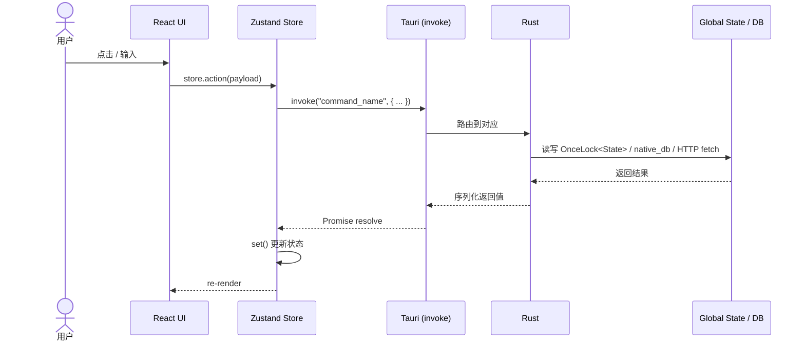
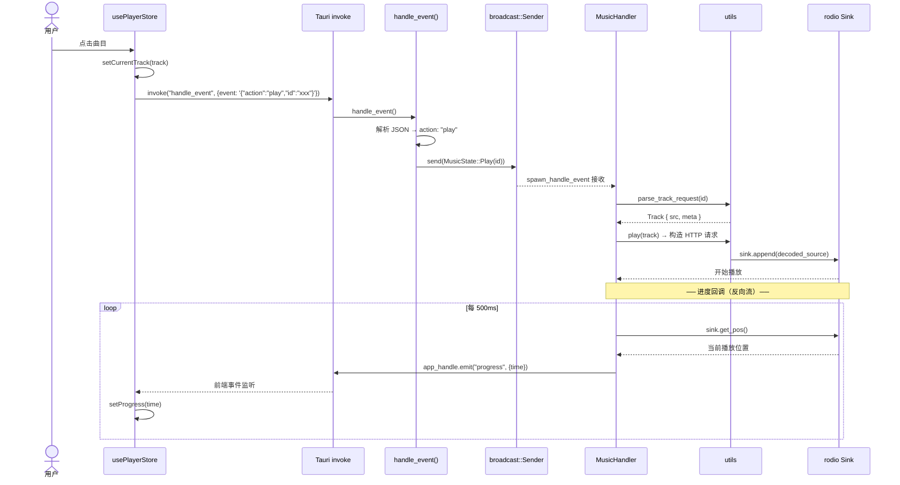
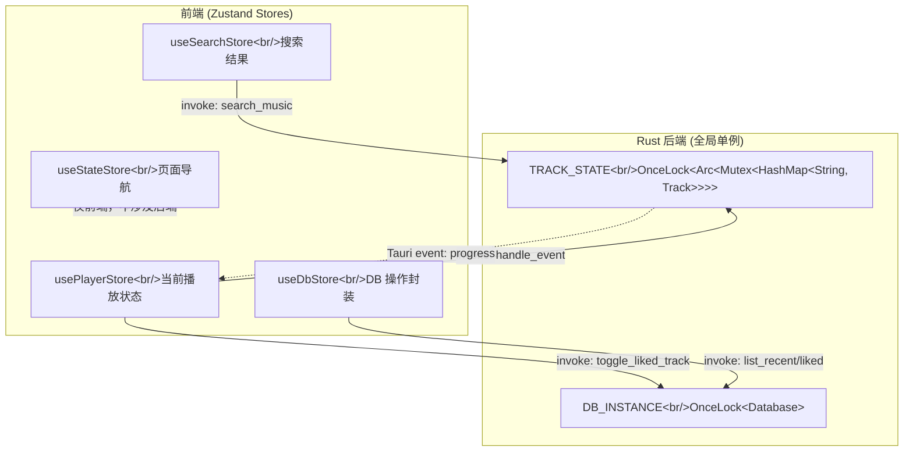
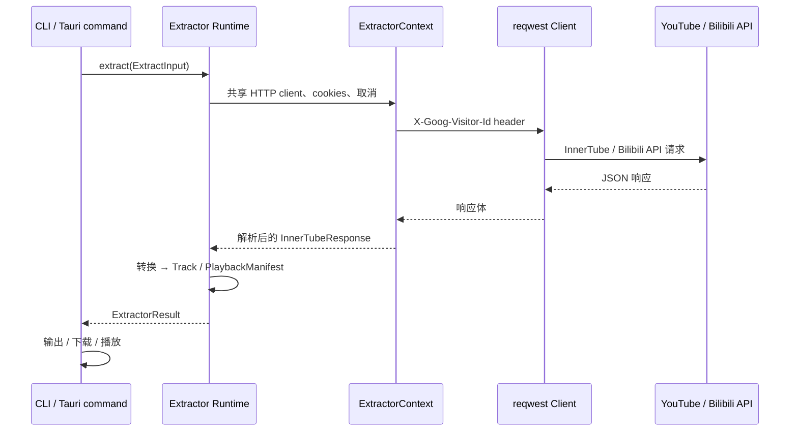

# Architecture: music_demo

> 持久基准文档。所有 `specs/<feature>/plan.md` 的 Technical Context 段落直接引用本文。
> 随项目演进更新；与具体功能需求解耦。

**最后更新**: 2026-07-19 (Extractor Runtime 架构)

---

## 1. 技术栈

| 层 | 技术 | 版本 |
|---|---|---|
| 桌面壳 | Tauri v2 | `2.9.x` |
| 前端框架 | React + TypeScript | `19.x` / `5.9.x` |
| 构建 | Vite | `7.x` |
| 样式 | Tailwind CSS | `4.x` |
| 状态管理 (FE) | Zustand | `5.x` |
| 路由 | react-router-dom | `7.x` |
| Rust edition | 2021 | — |
| 数据库 | native_db (SQLite) | `0.8.x` |
| 音频播放 | rodio (Symphonia 解码) | `0.21.x` |
| HTTP 客户端 (Rust) | reqwest | `0.12.x` |
| HTML 解析 | scraper | `0.25.x` |
| 序列化 | serde / serde_json | `1.x` |
| 异步 trait | async-trait | `0.1` |
| 错误处理 | thiserror | `2` |
| 密码学 | md5 / sha256 | — |
| CLI 框架 | clap (derive) | `4` |
---

## 2. 目录结构

```
src/                          # 前端 (React + TS)
├── main.tsx                  # 入口
├── App.tsx                   # 根组件（当前简化：直接渲染 TrackList）
├── components/               # 可复用 UI 组件
│   ├── MiniPlayer.tsx        #   迷你播放器（核心复杂度）
│   ├── TrackCard.tsx         #   曲目卡片
│   ├── TrackLibrary.tsx      #   曲库列表
│   ├── MainPageContent.tsx   #   主页内容布局
│   ├── SearchBar.tsx         #   搜索栏
│   ├── SearchContent.tsx     #   搜索结果
│   ├── TrackPage.tsx         #   曲目详情
│   └── ParseUrl.tsx          #   URL 解析输入
├── features/                 # 功能组合层（组装 components + store）
│   └── TrackLists.tsx        #   播放列表功能
├── pages/                    # 页面级组件
│   ├── MainPage.tsx
│   ├── TrackPage.tsx
│   └── SearchPage.tsx
├── layout/
│   └── MainLayout.tsx
├── hooks/                    # 自定义 hooks
│   ├── playHooks.ts
│   └── TrackLists.ts
├── store/                    # Zustand 状态管理
│   ├── Player.ts             #   播放状态（当前曲目、播放/暂停、进度）
│   ├── Db.ts                 #   数据库操作状态
│   ├── Search.ts             #   搜索状态
│   └── State.ts              #   页面导航状态
├── services/                 # 前端服务层（封装 Tauri invoke）
│   ├── dbServices.ts
│   ├── searchService.ts      #   (空壳)
│   └── playerService.ts      #   (空壳)
├── types/                    # 前端类型定义
│   ├── track.ts              #   Track 接口
│   ├── player.ts             #   PlayerState
│   └── state.ts              #   ContentState / StateEnum
└── platform/                 # 平台抽象层（预留，未激活）
    ├── types.ts
    └── mobile/


## 3. 运行时流程

### 3.1 整体数据流


```mermaid
sequenceDiagram
    actor U as 用户
    participant R as React UI
    participant Z as Zustand Store
    participant T as Tauri (invoke)
    participant C as Rust #[tauri::command]
    participant G as Global State / DB

    U->>R: 点击 / 输入
    R->>Z: store.action(payload)
    Z->>T: invoke("command_name", { ... })
    T->>C: 路由到对应 #[tauri::command] fn
    C->>G: 读写 OnceLock<State> / native_db / HTTP fetch
    G-->>C: 返回结果
    C-->>T: 序列化返回值
    T-->>Z: Promise resolve
    Z->>Z: set() 更新状态
    Z-->>R: re-render
```

### 3.2 播放链路


```mermaid
sequenceDiagram
    actor U as 用户
    participant PS as usePlayerStore
    participant T as Tauri invoke
    participant PUB as handle_event()
    participant CH as broadcast::Sender
    participant MH as MusicHandler
    participant UTL as utils
    participant SINK as rodio Sink

    U->>PS: 点击曲目
    PS->>PS: setCurrentTrack(track)
    PS->>T: invoke("handle_event", {event: '{"action":"play","id":"xxx"}'})
    T->>PUB: handle_event()
    PUB->>PUB: 解析 JSON → action: "play"
    PUB->>CH: send(MusicState::Play(id))
    CH-->>MH: spawn_handle_event 接收
    MH->>UTL: parse_track_request(id)
    UTL-->>MH: Track { src, meta }
    MH->>UTL: play(track) → 构造 HTTP 请求
    UTL->>SINK: sink.append(decoded_source)
    SINK-->>MH: 开始播放

    Note over MH,SINK: ── 进度回调（反向流）──

    loop 每 500ms
        MH->>SINK: sink.get_pos()
        SINK-->>MH: 当前播放位置
        MH->>T: app_handle.emit("progress", {time})
        T-->>PS: 前端事件监听
        PS->>PS: setProgress(time)
    end
```

### 3.3 状态架构


```mermaid
graph TB
    subgraph Rust["Rust 后端 (全局单例)"]
        TS["TRACK_STATE&lt;br/&gt;OnceLock&lt;Arc&lt;Mutex&lt;HashMap&lt;String, Track&gt;&gt;&gt;&gt;"]
        DB["DB_INSTANCE&lt;br/&gt;OnceLock&lt;Database&gt;"]
    end

    subgraph FE["前端 (Zustand Stores)"]
        P["usePlayerStore&lt;br/&gt;当前播放状态"]
        D["useDbStore&lt;br/&gt;DB 操作封装"]
        SE["useSearchStore&lt;br/&gt;搜索结果"]
        ST["useStateStore&lt;br/&gt;页面导航"]
    end

    P -->|"invoke: handle_event"| TS
    P -->|"invoke: toggle_liked_track"| DB
    D -->|"invoke: list_recent/liked"| DB
    SE -->|"invoke: search_music"| TS
    ST -->|"仅前端，不涉及后端"| FE

    TS -.->|"Tauri event: progress"| P
```

**Rust 全局单例**:
- `TRACK_STATE`: 以 UUID 为 key 缓存所有已加载曲目
- `DB_INSTANCE`: native_db 单例，持久化到 `./local.db`

### 3.4 Extractor Runtime 数据流


```mermaid
sequenceDiagram
    participant CLI as CLI / Tauri command
    participant EXT as Extractor Runtime
    participant CTX as ExtractorContext
    participant HTTP as reqwest Client
    participant API as YouTube / Bilibili API

    CLI->>EXT: extract(ExtractInput)
    EXT->>CTX: 共享 HTTP client、cookies、取消
    CTX->>HTTP: X-Goog-Visitor-Id header
    HTTP->>API: InnerTube / Bilibili API 请求
    API-->>HTTP: JSON 响应
    HTTP-->>CTX: 响应体
    CTX-->>EXT: 解析后的 InnerTubeResponse
    EXT->>EXT: 转换 → Track / PlaybackManifest
    EXT-->>CLI: ExtractorResult
    CLI->>CLI: 输出 / 下载 / 播放
```

**关键设计点**:
- 所有 Extractor 共享同一个 `reqwest::Client`（cookie_store 统一管理）
- YouTube: ANDROID_VR client + X-Goog-Visitor-Id（从首页提取，15min 缓存）
- Bilibili: 标准 API + WBI 签名（30s 密钥缓存）
- 搜索 → `Vec<Track>`，播放 → `PlaybackManifest`，统一应用层模型


## 4. 数据模型

### 4.1 实体

| 实体 | native_model id | 存储位置 | 说明 |
|---|---|---|---|
| `TrackDbItem` | `id=1, version=1` | native_db | 曲目持久化记录（id, title, artist, cover_url, duration, source） |
| `LikedTrack` | `id=2, version=1` | native_db | 收藏关系（id, created_at） |
| `RecentTrack` | `id=3, version=1` | native_db | 最近播放（id, played_at），上限 100 |

### 4.2 ID 生成

- 使用 **UUID v5**，namespace = `49be3fd4-a796-4392-9ce8-b7af0d3866f3`
- 输入：曲目的 **源 URL**（微信文章链接或 B站 BV 号对应的 URL）
- 保证同一 URL 始终生成相同 ID（幂等）

### 4.3 前端 Track 接口

```typescript
interface Track {
  title: string;
  artist: string;
  coverUrl: string;
  duration: number;  // 秒
  id: string;        // UUID v5
}
```

与 Rust `TrackView` 对应（`#[serde(rename_all = "camelCase")]`）。

### 4.4 Extractor 层数据模型


| 层 | 模型 | 用途 |
|---|---|---|
| Extractor 内部 | `RawMediaInfo` / `RawFormat` | yt-dlp 兼容的原始返回格式，保留所有字段在 `extra` map |
| 应用层 | `Track` / `PlaybackManifest` | 稳定的前端业务模型，UI 不依赖 yt-dlp 字段 |

```rust
// Extractor 层（yt-dlp 兼容）
pub struct RawMediaInfo {
    pub id: Option<String>,
    pub title: Option<String>,
    pub formats: Vec<RawFormat>,
    pub extra: serde_json::Map<String, Value>,  // 所有非结构化字段
}

// 应用层
pub struct Track {
    pub id: String,            // "yt:VIDEO_ID" 或 "bili:BV_ID"
    pub title: String,
    pub artists: Vec<String>,
    pub album: Option<String>,
    pub duration_ms: Option<u64>,
    pub artwork: Vec<Image>,
}

pub struct PlaybackManifest {
    pub streams: Vec<AudioStream>,
    pub headers: HashMap<String, String>,
}
## 5. 关键约束 & 已知问题

### 约束

- **`native_model` version 不能随意改**：改动 `#[native_model(id=N, version=V)]` 是破坏性迁移
- **`MAX_RECENT_TRACK_COUNT = 100`**：超过后最旧的记录被清除
- **cover URL 未做本地缓存**：封面图片每次从远程加载
- **`OnceLock` 只写一次**：`init_db()` / `init_track_state()` 必须在 `tauri::Builder` 之前调用
- **Extractor HTTP client 共享**：所有 extractor 共用 `ExtractorContext.http`，不得自行创建
- **Visitor data 缓存 15min**：YouTube ANDROID_VR 请求依赖首次首页提取的 visitor data
- **WBI 密钥缓存 30s**：Bilibili API 签名依赖定期刷新的 mixin key

### 已知技术债

- `App.tsx` 中路由逻辑被注释掉（原 `StateEnum` switch），当前直接渲染 `TrackList()`
- **WSL2 音频输出颗粒感**：问题在 cpal→PulseAudio→Windows 音频桥层，详见 `specs/002-audio-backend/spec.md`
- `storage.rs` 中 liked/recent track 的 CRUD 标记为需要重构（注释: "这么写不太优雅"）
- `music_fetch::bilibili` 旧版搜索逻辑与新 `extractor::bilibili` 并存，待统一
- `src/services/searchService.ts` 和 `playerService.ts` 为空壳
- **YouTube 音频流依赖 ANDROID_VR client**：部分视频返回 UNPLAYABLE，需兜底到页面 scraping

---

## 7. 参考

- `specs/` — 功能级 spec / plan / design
- `docs/` — 架构文档、技术规范
- [`AGENTS.md`](./AGENTS.md) — 模块索引、Extractor 协议详情、CLI 使用说明


