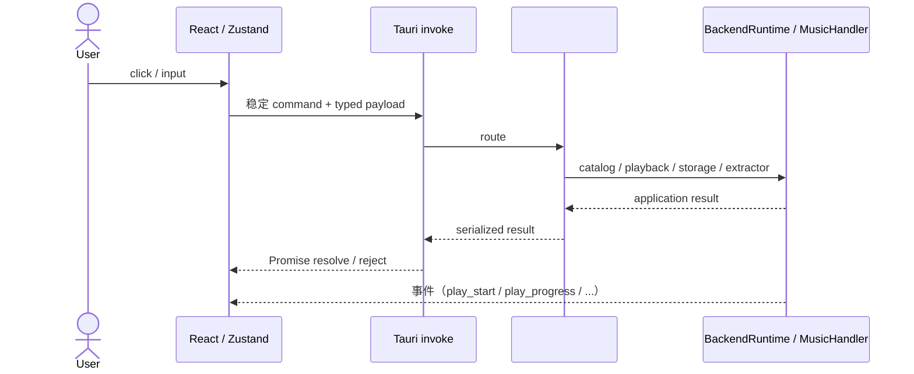
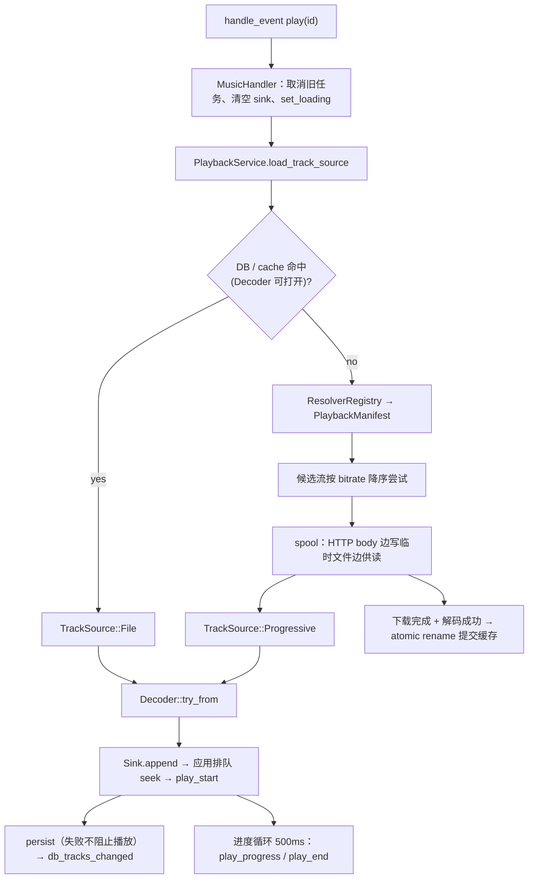

# Architecture: music_demo

> 运行时基准文档：只描述当前实现、稳定边界和扩展规则，不记录废弃方案。符号一律以代码为准。
>
> 契约细节见 [contracts.md](./contracts.md)；新增来源见 [extension-guide.md](./extension-guide.md)；可观测性见 [observability.md](./observability.md)。

---

## 1. 一句话模型

三条链路、一条边界：

- **搜索链路**：`search_music` → `SearchRegistry`（按注册顺序枚举来源）→ 来源 adapter → extractor → 统一 `TrackView`；
- **播放链路**：`handle_event(play)` → `PlaybackService`（cache 命中即播；未命中走 resolver + spool 流式下载）→ rodio Decoder + Sink → 播放事件；
- **状态同步**：后端是播放状态唯一状态源（SSOT），前端是「事件流 + `get_playback_state` 快照 + 超时兜底」的投影。

前端只知道 `TrackView`、command 和播放事件。来源识别、临时音频 URL、缓存、decoder、数据库细节全部留在 Rust。

---

## 2. 设计原则

### 2.1 稳定边界优先

- command 名称、参数形状、`TrackView`、播放事件是外部契约（见 contracts.md）；
- 前端不接触 `PlaybackManifest`、`AudioStream` 或带签名的音频 URL；
- DB 只保存稳定的 track/source reference 和本地缓存路径，不保存短期 manifest URL。

### 2.2 开闭原则

核心播放流程对新来源关闭，对来源 adapter 开放：

| 闭合的核心 | 开放的扩展点 |
|---|---|
| `PlaybackService` 的缓存/取消/下载/decoder/持久化流程 | 来源 adapter（`SearchProvider` + `PlaybackResolver`） |
| `MusicHandler` 的 Sink 生命周期与事件发射 | `ResolverRegistry` / `SearchRegistry` 注册新 adapter |
| `search_music` 的统一分发与去重 | `SearchRegistry` 枚举新增来源 |
| 前端播放状态机 | `frontendLog` 的日志来源与级别 |

新增来源时，修改范围限制在：

1. 来源自己的 extractor 与 adapter；
2. `SourceKind` / `SourceRef` / `TrackId` 这一层的稳定标识；
3. composition root `playback/runtime.rs` 的一次注册；
4. 必要的测试。

**禁止**在 `PlaybackService`、`MusicHandler` 或前端组件中增加来源分支。来源差异必须停留在 resolver 和边界适配器内。

### 2.3 认知负担最小化

- 一个问题一个主入口：播放问题先看 `PlaybackService`，输出问题再看 `MusicHandler`；
- 一个来源一个 adapter（同时实现搜索与解析）；旧微信记录经 `to_source_ref` 直连 `WechatResolver`，旧 bilibili 记录仅保留序列化墓碑（可读不可播）；
- 一个播放请求一个 `trace_id`，所有阶段使用同一组字段（见 observability.md）；
- 不为一次性逻辑新增 service、manager 或 facade。

---

## 3. 模块地图

### 3.1 前端 `src/`

```text
src/
├── main.tsx                    # 安装前端日志转发，挂载 React
├── App.tsx                     # 页面状态选择 + Toast
├── pages/                      # SearchPage / TrackPage / MainPage
├── components/                 # SearchBar、SearchContent、TrackCard、MiniPlayer、ParseUrl
├── layout/                     # MainLayout
├── store/                      # Player（播放）、Search、Db（recent/liked）、Error（Toast）、State（页面）
├── services/                   # invoke.ts（safeInvoke）、frontendLog.ts（日志转发）
└── types/                      # Track、PlayerState、页面状态
```

### 3.2 Rust `src-tauri/src/`

```text
src-tauri/src/
├── lib.rs                      # composition root：init_db、init_track_state、注册 commands
├── public.rs                   # 前端公开 commands（含 search_music 分发）
├── music_handler/              # publics.rs（action 解析）、handler.rs（Sink/任务/事件）、status.rs（SSOT）
├── playback/
│   ├── runtime.rs              # 组装 context / catalog / 两个 registry / service
│   ├── model.rs                # SourceKind、TrackId、SourceRef、PlayableEntry
│   ├── catalog.rs              # 内存 catalog：稳定 ID → PlayableEntry
│   ├── resolver.rs / search.rs # PlaybackResolver / SearchProvider trait + registry + track_to_entry
│   ├── service.rs              # cache → resolve → 流式下载 → atomic commit
│   ├── spool.rs                # SpoolState / BlockingSpoolReader（边下边播）
│   ├── trace.rs                # PlaybackTrace：trace_id + 阶段日志
│   └── <source>.rs             # youtube / bilibili / wechat / showroom adapter
├── extractor/                  # context.rs（共享 ExtractorContext）、model.rs、protocol.rs、<source>/
├── music_fetch/                # wx.rs（公众号内嵌音乐）
├── audio_quality/              # instrumented_sink.rs（Sink 装饰器）、probe.rs（欠载测量引擎）
├── storage.rs / global.rs / types.rs  # native_db schema、DB/catalog 初始化、TrackView/TrackMeta
```

### 3.3 CLI `cli/`

`cli/src/main.rs` — 基于 `app_lib` 的 extractor 调试 CLI（`music-cli`），子命令见 README。CLI 直连 `ExtractorContext`，不经过播放管线。

---

## 4. 运行时边界

### 4.1 command / event 边界


```mermaid
sequenceDiagram
    actor U as User
    participant UI as React / Zustand
    participant IPC as Tauri invoke
    participant CMD as #[tauri::command]
    participant RT as BackendRuntime / MusicHandler

    U->>UI: click / input
    UI->>IPC: 稳定 command + typed payload
    IPC->>CMD: route
    CMD->>RT: catalog / playback / storage / extractor
    RT-->>CMD: application result
    CMD-->>IPC: serialized result
    IPC-->>UI: Promise resolve / reject
    RT-->>UI: 事件（play_start / play_progress / ...）
```

command 全集、`handle_event` actions、事件表见 contracts.md。

### 4.2 播放流程（含 spool 流式）


```mermaid
flowchart TD
    A["handle_event play(id)"] --> B["MusicHandler：取消旧任务、清空 sink、set_loading"]
    B --> C["PlaybackService.load_track_source"]
    C --> D{"DB / cache 命中<br/>(Decoder 可打开)?"}
    D -- yes --> I["TrackSource::File"]
    D -- no --> E["ResolverRegistry → PlaybackManifest"]
    E --> F["候选流按 bitrate 降序尝试"]
    F --> G["spool：HTTP body 边写临时文件边供读"]
    G --> H["TrackSource::Progressive"]
    I --> J["Decoder::try_from"]
    H --> J
    J --> K["Sink.append → 应用排队 seek → play_start"]
    K --> L["persist（失败不阻止播放）→ db_tracks_changed"]
    K --> M["进度循环 500ms：play_progress / play_end"]
    G --> G2["下载完成 + 解码成功 → atomic rename 提交缓存"]
```

顺序约束：

1. 旧 task 先取消、sink 先清空，新曲目才能继续；
2. 缓存命中必须通过 Decoder 打开校验，零字节/损坏文件视为 miss 走重新下载；
3. 未命中时走 spool：HTTP body 边写临时文件边喂给 decoder，`BlockingSpoolReader` 读越过下载边界时阻塞，下载失败向读端报错；
4. 下载完成且解码器成功打开后才 atomic rename 提交缓存；取消、解码失败、写盘失败都清理临时文件；
5. decoder 和 Sink append 成功、排队 seek 应用之后才发送 `play_start`；
6. RecentTrack 持久化失败不能阻止已经开始的播放；
7. append 之后被取消：清空 sink 并 discard（移除 recent 记录与缓存文件）；
8. 下载期间（sink 为空）的 seek 排队，后到覆盖先到，新 play 清空排队值。

### 4.3 搜索分发

- `search_music({ keyword, source? })`：空 keyword 直接返回空数组；`source` 缺省或 `"all"` 枚举全部已注册来源（`SearchRegistry::sources()` 保持注册顺序），否则按来源名过滤；未知来源名报错；
- 单来源失败只记日志、不阻塞其它来源；全部失败才整体返回错误；
- 结果按 `view.id` 去重，每个 entry 同时写入内存 `TrackCatalog`，后续播放无需再查 DB；
- 新增来源只需注册，`search_music` 与 `public.rs` 的分发零改动。

### 4.4 extractor 层

所有 extractor 共享一次创建的 `ExtractorContext`：

```text
BackendRuntime
  └── Arc<ExtractorContext>
        ├── reqwest::Client
        ├── ExtractorOptions
        ├── 取消与 logger
```

来源 extractor 只负责协议解析和来源数据转换：

```text
source response
  → extractor model（Track / AudioStream / PlaybackManifest）
  → adapter 统一成 PlayableEntry / PlaybackManifest
```

extractor 不负责 Sink、RecentTrack 或前端状态；来源专属字段停留在 extractor model 或 `SourceRef`，在 adapter 边界转换掉。每个 extractor 必须使用共享 context，禁止自建 HTTP client。

---

## 5. 变更指南

| 需求 | 首先修改 | 不要修改 |
|---|---|---|
| 新来源播放 | `playback/<source>.rs`、`extractor/<source>/`、runtime.rs 注册 | `PlaybackService`、`MusicHandler`、前端组件 |
| YouTube / Bilibili 流选择 | `extractor/youtube/player.rs`、`extractor/bilibili/player.rs` | 前端播放状态 |
| cache / 下载 / 取消 | `playback/service.rs` | 来源 resolver 的协议代码 |
| decoder / Sink / 音量 / 暂停 | `music_handler/handler.rs` | DB schema |
| 进度和欠载 | `audio_quality/probe.rs` + handler 进度循环 | 前端 event payload |
| command 参数 | `public.rs`、`lib.rs`、对应前端 service | 随意新增同义 command |
| 前端错误 / 日志 | `services/frontendLog.ts`、`services/invoke.ts` | 在每个组件重复写上报逻辑 |
| 收藏 / 最近播放 | `public.rs`、`storage.rs`、`store/Db.ts` | 另建第二套 DB store |

变更完成标准：

1. 新行为有一个明确的 owner module；
2. 核心 pipeline 没有新增来源分支；
3. command / event 契约没有无意变化；
4. 失败路径有结构化日志（target `playback_trace`）；
5. 至少有一个行为测试和一次真实启动/调用 smoke。
