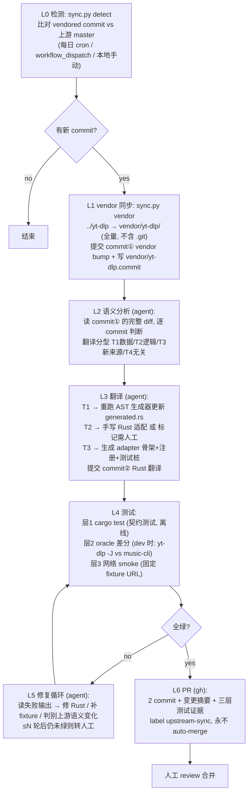
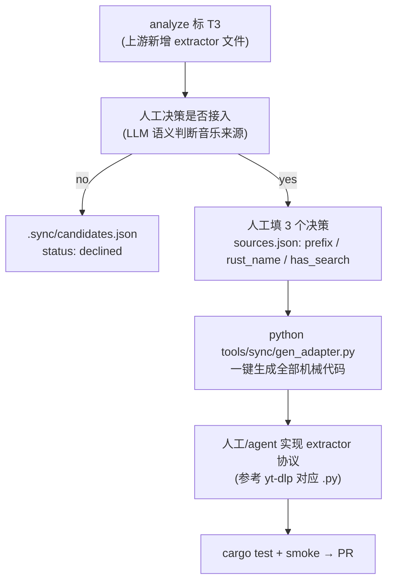

# Agent Workflow: yt-dlp 参考同步 → AI 翻译 → 测试驱动 PR

> 状态：brainstorm 定稿（未实施）
> 作者：Main + 4 brainstorm agents，2026-08-06
> **取代** `docs/proposals/upstream-sync-workflow.md`（其关键词/路径/规则过滤方案被用户否决，见 §0）。
> 关联：`docs/proposals/ytdlp-youtube-field-sync.md`（字段映射/生成器，本方案 T1 翻译直接复用）、`docs/proposals/ytdlp-new-source-sync.md`（新来源骨架生成，本方案 T3 复用）、`docs/proposals/ytdlp-bridge-vs-static.md`（桥接路线被否决，本方案不打包）。

## 0. 决策记录

| 决策 | 内容 |
|---|---|
| 否决 | **关键词/路径/规则匹配**（tiers.yaml、watchlist.yaml、commit 前缀分类）——用户旗帜鲜明反对。理由：启发式必漏。活例：`yt-dlp@fdcc954df _base.py:229` 注释显示 2026.07 起 ANDROID_VR 非 HLS **选择性强制 POT**（`GVS_PO_TOKEN_POLICY required`），而 clientVersion 字符串分毫未动——任何 token 匹配都抓不到这类策略级变化 |
| 否决 | **桥接打包路线**（sidecar 分发 yt-dlp）——用户选定纯参考：不打包、不引入 Python 运行时 |
| 选定 | **纯参考 + agent 翻译**：yt-dlp 源码 vendored 进本仓库作 dev-time 参考；上游更新时 agent 语义分析上游 diff，翻译成 Rust extractor 改动；测试是唯一验收过滤器 |
| 原则 | 全量同步 + 语义分析 + 测试验证。**零规则文件、零过滤配置**。测试红不红 = 是否影响我们的 ground truth |

## 1. 总览



## 2. 阶段细节

### L0 检测（脚本，全自动）

`tools/sync/sync.py detect`：
- 读 `vendor/yt-dlp.commit`（上次同步的上游 commit sha）；
- `git -C ../yt-dlp fetch origin`（本地 clone 通道，兼容手动拉新；`--offline` 只读现状）；
- 上游 `master` sha ≠ 锁定 sha → 输出「有 N 个新 commit」+ 退出码 0，供 CI cron 判定触发后续阶段。

触发：GitHub Actions `schedule: cron "17 3 * * *"` + `workflow_dispatch` + 本地 CLI。只做检测的 job 不写仓库。

### L1 vendor 同步（脚本，全自动）

`tools/sync/sync.py vendor --commit <sha>`：
- 从 `../yt-dlp` 全量复制到 `vendor/yt-dlp/`（排除 `.git`、`.venv`、`bundle/` 等构建产物；保留 `yt_dlp/` 全部 941 个 extractor、`test/`、`pyproject.toml`、`version.py`、`Changelog.md`）；
- 写 `vendor/yt-dlp.commit`（锁文件，进 git）；
- `git add vendor/ && git commit` → **commit ① vendor bump**。

> **GitHub 托管变体（推荐）**：上游不在本机时（CI runner），改为「锁 commit + runner 内 clone」——workflow 里 `git clone --depth 1 https://github.com/yt-dlp/yt-dlp.git _upstream`，锁文件 `.sync/upstream-state.json` 记 `{last_sha, last_date, upstream_version}`；**不 vendor 进 git**（PR 只含 Rust 翻译改动，review 干净；审计靠锁文件 + PR 描述的 commit range）。

理由（全量 vendor 而非只锁 commit）：PR 自包含（reviewer 不用跳上游仓库）、agent 翻译直接读本地 vendored diff（`git show commit①` 即上游变更全貌）、git 历史天然版本锁定、可整体 revert。23MB 源码进 repo 可接受（很多项目 vendor 更大）；同步产物天然是「上一版本 → 新版本」的完整 diff，无需任何过滤即可作为分析输入。

### L2 语义分析（agent）

输入：commit① 的 `git show --stat` + 逐 commit diff（**全量给 agent 读，无规则预过滤**）。
Agent 任务：
1. 读每个上游 commit 的 diff（python 代码）；
2. 判断翻译分型（§3）；
3. 产出分析清单：`{commit, 分型, 影响面(我们哪个 Rust 文件), 建议动作}`。

### L3 翻译（agent）

按 §3 分型执行。产物为 **commit② Rust 翻译**，与 commit① 分离，review 可只看②。

### L4 测试（三层，测试即过滤器）

| 层 | 内容 | 离线 | 成本 | 判定 |
|---|---|---|---|---|
| 1 | `cargo test`：现有契约测试（`search()`/`player()` 请求体序列化断言、URL 构造、响应 fixture 解析）+ `generated.rs` 一致性断言（防手写与生成常量漂移） | ✅ | 秒级 | **必绿，阻塞** |
| 2 | oracle 差分（dev/CI 可选）：对固定 fixture URL，`python -m yt_dlp -J`（用 vendored 源码 + Python 3.12）vs `music-cli`，比对 title/duration/stream 数量/URL 前缀（googlevideo.com）；差异 = 翻译错误信号 | ❌ 需网络 | 分钟级 | 警告不阻塞，进入 PR 证据 |
| 3 | 网络 smoke：固定 fixture（如 YouTube 1 条 + Bilibili 1 条）解析成功 + `validate_url` 200/206 | ❌ 需网络 | 分钟级 | 必过（CI 夜间或手动） |

yt-dlp 自带测试（`pytest -m "not download"`，实测 50s/880 passed）**不跑**：vendored 代码不被运行时使用，上游测试只验证上游自己，价值低；我们验收的是翻译产物，用层 1-3。

### L5 修复循环（agent）

层 1 红 → agent 读 cargo 失败输出：
- 翻译错误 → 修 Rust；
- 上游字段/结构变化 → 更新 `types.rs` 反序列化/fixture；
- 语义判断错误（T2 误标 T4）→ 重新分析。
≤3 轮未绿 → 中止，PR 转 draft 并标注「需人工」，绝不带红合入。

### L6 PR（脚本 + agent 描述）

`gh pr create`：
- 2 commit：① vendor bump ② Rust 翻译；
- body：上游版本 `old..new`、变更摘要（agent 写）、三层测试结果表格、T2 需人工项清单、T3 新来源骨架清单；
- `label: upstream-sync`，**永不 auto-merge**，过现有 `build.yml` 门禁。

## 3. 翻译分型（agent 语义判断，非规则）

| 分型 | 上游改动形态 | 我方动作 | 自动化程度 |
|---|---|---|---|
| T1 纯数据 | `INNERTUBE_CLIENTS` 常量、端点、正则字面量、PO 策略布尔（`_base.py`/`_video.py` 字面量区） | 复用 `scripts/sync_ytdlp.py` AST 提取（`ytdlp-youtube-field-sync.md` §3）重跑 → 更新 `generated.rs` | **全自动** |
| T2 逻辑 | 签名算法、po_token 求解、解析路径/字段结构、流选择 | agent 手写 Rust 适配；难度高或风险大 → 标记「需人工」，不阻塞其余翻译 | 部分自动 |
| T3 新来源 | 上游新增 extractor 文件（`yt_dlp/extractor/<site>.py`） | 复用 `gen_adapter.py` + marker 块（`ytdlp-new-source-sync.md` §3）生成骨架：`extractor/<site>/` 桩 + adapter + SourceKind/TrackId/SourceRef + runtime 注册 + 前缀表 + 契约测试桩；extractor 协议实现列入后续任务（issue 模板） | 骨架全自动，实现不自动（诚实边界） || T4 无关 | 其他 900+ 站点、postprocessor、下载器等 | 不进 PR 主体，计入摘要统计 | 全自动（agent 判断） |

## 4. 可审计性与回滚

- `vendor/yt-dlp.commit` 锁文件 = 上游版本锚点；`git show commit①` = 同步内容全貌；
- 回滚 = `git revert <PR merge>`（vendor 与翻译一起回退）；
- commit① 与 commit② 分离 → 可单独 review/回退翻译而不动 vendor；
- 上游 force-push / 路径重构：T2 标记人工，不自动处理。

## 5. 落地路径

| 步 | 内容 | 交付物 | 周期 |
|---|---|---|---|
| P0 | `tools/sync/sync.py`（detect/vendor）+ `vendor/yt-dlp.commit` 锁 + 首次 vendor 入库 | 可重复的同步脚本 | 1 天 |
| P1 | T1 试点：AST 提取脚本 + `generated.rs` + api.rs 改用常量 + 一致性断言测试；跑一轮真实上游 diff 验证翻译闭环 | YouTube client 配置自动同步 | 2-3 天 |
| P2 | L2/L3 agent 编排（task 定义 + 分析清单 schema）+ oracle 差分脚本 | 首个 agent 驱动的完整同步 PR（YouTube 纯数据变更） | 3-5 天 |
| P3 | L5 修复循环 + L6 PR 自动化（gh + 模板）+ CI cron 接线 | 端到端无人值守（人工 review 除外） | 2-3 天 |
| P4 | T3 新来源骨架生成接入 workflow + issue 模板 | 新来源自动发现+骨架+立项闭环 | 2 天 |

## 7. GitHub Actions 托管映射（2026-08-06 补充）

方案可完全由 GitHub Workflow 托管，agent 执行器用官方 `anthropics/claude-code-action`（在 runner 上跑 Claude Code 完整工具循环：读 diff → 改 Rust → 跑测试 → 修复）。三个结构性差异 vs 本地版：

| 本地版 | GitHub 托管版 | 原因 |
|---|---|---|
| 上游 `../yt-dlp` 本机 clone | workflow 内 `git clone --depth 1` 到 `_upstream/` + 锁文件 | runner 是全新环境，无本机路径 |
| vendor 进 repo（commit①） | **不 vendor**，锁 `.sync/upstream-state.json`；PR 只含 Rust 翻译 | 每次 PR 带几 MB 上游 diff 不可 review；审计靠锁文件 + PR 描述的 commit range |
| oracle 现场跑 `yt-dlp -J` | **黄金 fixture**：本地录制的 `tools/sync/fixtures/*.json` 离线比对 | GitHub runner 出口是 Azure 云 IP，YouTube/Bilibili 反爬更严（Bilibili 对本机都 412）；fixture 过期本身即同步信号 |
| 网络 smoke 随时跑 | CI 内降级/每周本地手动 | 同上，云 IP 反爬 + 网络抖动 |

### 7.1 workflow 骨架

```yaml
name: Upstream sync (yt-dlp)
on:
  schedule: [{ cron: "17 3 * * *" }]
  workflow_dispatch: {}
concurrency: { group: upstream-sync, cancel-in-progress: true }
permissions:
  contents: write
  pull-requests: write

jobs:
  detect:   # L0 纯脚本，秒级
    runs-on: ubuntu-latest
    outputs: { has_new: ..., sha: ... }
    steps:
      - uses: actions/checkout@v4
      - run: git ls-remote https://github.com/yt-dlp/yt-dlp.git refs/heads/master
      - run: python .github/scripts/detect.py   # 比对锁 sha

  sync:     # L1-L6，仅 has_new 时跑；执行器 = 自研脚本 + OpenAI 兼容 API（零第三方 agent action）
    needs: detect
    if: needs.detect.outputs.has_new == 'true'
    runs-on: ubuntu-latest
    steps:
      - uses: actions/checkout@v4
      - run: git clone --depth 1 https://github.com/yt-dlp/yt-dlp.git _upstream
      - uses: actions/setup-python@v5
        with: { python-version: "3.12" }
      - uses: actions-rust-lang/setup-rust-toolchain@v1
      # 系统依赖照抄 build.yml（libwebkit2gtk 等）
      - run: python tools/sync/agent.py analyze --upstream _upstream   # L2 分型
      - run: python tools/sync/agent.py translate --upstream _upstream # L3 翻译
      - run: python tools/sync/agent.py fix                            # L5 修复循环
      - run: python tools/sync/agent.py report                         # L4 证据 + report.md
        env:
          LLM_API_KEY: ${{ secrets.LLM_API_KEY }}
          LLM_BASE_URL: ${{ secrets.LLM_BASE_URL }}
          LLM_MODEL: ${{ secrets.LLM_MODEL }}
      - run: |   # L6
          git checkout -b upstream-sync-$(date +%F)
          git config user.name "upstream-sync[bot]" ...
          git add -A && git commit -m "chore(upstream): sync yt-dlp OLD..NEW + translation"
          git push -u origin ...
          gh pr create --label upstream-sync --body-file .sync/report.md
```

### 7.3 脚本执行器设计（2026-08-06 追加：不依赖 Copilot / claude-code-action）

执行器为自研脚本 `tools/sync/`，纯 Python 标准库（`urllib`），零第三方依赖：

```text
tools/sync/
├── llm.py      # OpenAI 兼容客户端：LLM_BASE_URL/LLM_API_KEY/LLM_MODEL 三个 env，json_mode 支持，429 退避重试
├── agent.py    # analyze / translate / fix / report 四个子命令（argparse）
└── .sync/      # 状态与产物（锁文件提交，out/ 产物 gitignore）
    ├── upstream-state.json   # {last_sha, last_date, upstream_version}
    ├── analysis.json         # L2 分型清单 [{commit, type, files, action}]
    └── report.md             # PR body
```

- **确定性循环在脚本，LLM 只做理解与生成**：diff 获取、补丁应用、cargo test、重试计数全在 Python 里，LLM 每次调用无状态（prompt 自带上下文）；
- **analyze**：`git log last..HEAD` + 逐 commit diff → prompt 要求输出 JSON 分型清单（T1-T4）→ 校验 schema 后落盘；diff 过大时分批调用；
- **translate**：对 T1/T2/T3 项，prompt 附带「上游 diff + 我方相关文件内容」→ LLM 输出 unified diff 或整文件内容 → 脚本 `git apply --check` 校验 + **路径白名单**（仅 `src-tauri/src/`、`tools/sync/`、`.sync/`）后才应用；
- **fix**：`cargo test --lib` 失败输出回喂 LLM → 生成修复 → 重测，≤3 轮；
- **安全**：LLM 输出视为不可信（上游 diff 可注入）——JSON schema 校验 + 补丁路径白名单 + 只读 `_upstream`；prompt 中明确「禁止动 workflow、禁止提交 secrets」；
- 本机与 CI 同一套脚本：本地 `--upstream ../yt-dlp`（直接用本机 clone），CI `--upstream _upstream`，env 从 `.env`（gitignore）或 GitHub secrets 注入。

### 7.2 成本与安全

- **Actions 分钟**：detect 秒级；sync 每次 ~10-20 分钟（Rust 编译为主）。私有 repo 免费 2000 分钟/月，日跑 ≈ 400-600 分钟/月，够用；公开 repo 免费。
- **API 成本**：free LLM key（OpenAI 兼容端点：OpenRouter/DeepSeek/Gemini/Groq 等均可），月度 $0-几；上游每日有 commit → 每日一次 agent 调用，token 可控（分批分析）。节流：cron 改每周 + dispatch 手动。
- **安全**（agentic CI 已知风险面）：agent 处理的是上游 diff（不可信内容），存在 prompt injection 面。缓解：`permissions` 最小化（contents+pull-requests）、LLM key 只注入 sync job、不给 agent job 暴露 TAURI_SIGNING_PRIVATE_KEY 等其余 secrets、PR 永不 auto-merge。脚本侧：LLM 输出 JSON schema 校验 + 补丁路径白名单（§7.3）。

## 8. 风险与边界（不承诺项）

- **agent 翻译错误**：oracle fixture 差分（层 2）+ 人工 review 双兜底；翻译只进 commit②，回滚粒度清晰；
- **T2 高难逻辑（签名/POT）不自动**：上游 `jsc/`+`pot/` 架构（Python director + 外部 JS 引擎）无法自动移植到 Rust，标记人工并给出参考范围——这是能力边界，不是流程缺陷；
- **T3 extractor 协议实现不自动**：新来源自动发现 + 骨架 + 注册全自动，逆向实现仍需人工或 agent 辅助（每个 300-500 行 Python）；
- **上游大重构**（如 youtube 拆包再拆）：agent 分析会标记 T2 人工，PR 转 draft；
- 网络 smoke 需要外网：CI 夜间跑，失败转 issue 不阻塞当日 PR。

## 9. T3 新来源接入流程（2026-08-06 落地：gen_adapter.py）



### 9.1 已实现（`tools/sync/gen_adapter.py`，实测验证）

读 `tools/sync/sources.json`（人工维护注册表，status in_progress/adopted 且带 prefix/rust_name 的条目），幂等生成：

| 产物 | 位置 | 说明 |
|---|---|---|
| extractor 协议桩 | `src-tauri/src/extractor/<site>/{mod,search,player}.rs` | 返回 `ExtractionFailed("not implemented")`，TODO 注释指向上游 .py 文件 |
| adapter | `src-tauri/src/playback/<site>.rs` | 完整 `SearchProvider` + `PlaybackResolver` + 契约测试骨架（ID 前缀 round-trip、错误来源拒绝） |
| SourceKind / TrackId / SourceRef | `playback/model.rs` marker 块 | 枚举臂 + as_str + Display/FromStr + kind() |
| TrackMeta 持久化 | `types.rs` marker 块 | `from_source_ref`/`to_source_ref` 的 `prefix:` 分支（DB 兼容零新变体） |
| track_to_entry 前缀表 | `playback/search.rs` marker 块 | remote_id 提取 + source_ref 构造 |
| 注册 | `playback/runtime.rs` + `mod.rs` + `extractor/mod.rs` marker 块 | resolver 恒注册；search 按 has_search |

**marker 块机制**：`// ==== sync-generated:begin <name> ====` ... `// ==== sync-generated:end <name> ====`，生成器每次整体重写块内内容（幂等，重跑无 diff），块外人工改动不受影响。首次放置需人工（一次性，见 9.3），之后全自动。

**人工残留（最小集）**：
1. `sources.json` 填 3 个决策：`prefix`（≤8 字符小写，全局唯一，yt:/bili: 已占用）、`rust_name`、`has_search`（false = resolver-only）；
2. 实现 `extractor/<site>/` 协议（参考 `../yt-dlp/yt_dlp/extractor/<file>.py`）。

### 9.4 验收标准：测试跑通才算接入完成（2026-08-06 定稿，行为级）

**原则：测试是唯一的通过标准。** 新增来源完成 = 两个行为测试跑通：

| # | 行为测试 | 验证什么 | 何时跑 | 未实现时 |
|---|---|---|---|---|
| 1 | `can_search_via_mock` | **来源能搜索**（mock）：本地 mock 搜索端点 → 真实 HTTP 代码路径 → 非空 Track | CI 门禁（离线） | 🔴 红（fixture 占位 `{}` 断言） |
| 2 | `resolves_then_spools_and_caches` | **能解析 + 缓存/流式下载**（mock）：manifest → spool 流式下载 → 内容一致 → 缓存原子提交 → 二次命中 | CI 门禁（离线） | 🔴 红（`assert!(false)` 占位） |
| 3 | `can_resolve_manifest_via_mock` | manifest 解析正确性（mock，辅助层） | CI 门禁（离线） | 🔴 红 |
| 4 | `real_site_search_smoke` | **真实站点能搜索**：真实网络调用 | 夜间/发布前 job（`#[ignore]`） | 🔴 红 |
| 5 | `real_site_player_smoke` | **真实站点能解析播放**：真实网络调用已知 ID | 夜间/发布前 job（`#[ignore]`） | 🔴 红 |

**为什么 mock 与真实流量双轨**（不能互相替代）：
- mock 测**解析逻辑正确性**：快、确定性、断言精确，CI 可作门禁；但「录什么测什么」——fixture 不更新则测不出站点协议变化（假绿）；
- 真实 smoke 测**站点连通性**：反爬/登录态/IP 风控/字段漂移只有真实流量能暴露；但慢、不稳定（Bilibili 对本机都 412），不能当 CI 门禁；
- **闭环**：真实 smoke 红 = 站点/协议变了 → `record_fixture.py` 录新 fixture → mock 更新 → 全绿。mock 不是替代真实，是让真实变化可追溯、可回归。

**驱动机制**（测试驱动接入）：
- 生成器写入的模板测试**默认红**（fixture 占位断言 / `assert!(false)` 占位）——未实现时 CI 必然红，阻止半成品合入；
- 实现协议 + 录制真实 fixture（`record_fixture.py`）+ 填 TODO 断言 → 测试从红变绿 = 接入完成；
- 禁止 `#[ignore]` 绕过（= 假绿）。

**基础设施**（已实现）：
- `ExtractorOptions.endpoints: HashMap<String,String>` + `endpoint(name, default)` / `with_endpoint(name, url)`——新来源模板代码用 `ctx.options.endpoint("search", SEARCH_ENDPOINT)` 取端点，测试注入 `127.0.0.1` mock 地址；存量 youtube/bilibili 不动（开闭原则）；
- 行为测试 2 复用现有 `downloads_once_and_reuses_stable_cache` 先例（TcpListener 音频 mock → spool → 缓存），已验证可用。

**录制工具**（`tools/sync/record_fixture.py`）：`--url` 录 HTTP 响应 / `--from-ytdlp` 用 yt-dlp -J 录 oracle；音频 fixture 用 `--url` 直录音频文件。

**禁止事项**：
- 不得提交占位 fixture 且 `#[ignore]` 绕过（假绿）；
- 不得删除行为测试 1/2；
- fixture 只录真实响应，禁止手写编造。

### 9.2 实测结果（showroom 试点）

- `gen_adapter.py` 对 showroom（`prefix=srm`, `rust_name=Showroom`, resolver-only）生成 7 处改动全部正确；
- `cargo check`：showroom 相关零错误（剩余 2 个错误为工作区存量：`legacy_bilibili`/`music_fetch::bilibili` 模块被删但引用未清，与生成器无关）；
- 幂等性验证：重跑 `md5` 一致；空 sources.json 时零操作。

### 9.3 marker 块放置清单（一次性，首次由人工/迁移脚本完成）

| 文件 | 块名 | 位置 |
|---|---|---|
| playback/model.rs | source_kinds | `pub enum SourceKind {` 内 |
| playback/model.rs | source_kind_as_str | `as_str()` 的 match 内 |
| playback/model.rs | track_id_display | `Display` 的 match 内 |
| playback/model.rs | track_id_fromstr | `FromStr` 的 strip_prefix 链末 |
| playback/model.rs | source_ref | `pub enum SourceRef {` 内 |
| playback/model.rs | source_ref_kind | `kind()` 的 match 内 |
| types.rs | track_meta | `from_source_ref` 的 match 内 |
| types.rs | track_meta_reverse | `to_source_ref` 的 strip_prefix 链末 |
| playback/search.rs | track_to_entry / track_to_entry_ref | `track_to_entry` 两个 match 内 |
| playback/runtime.rs | runtime_register / runtime_register_search / runtime_use | 两个 registry + use 导入 |
| playback/mod.rs | playback_mod_decl | 模块声明区 |
| extractor/mod.rs | extractor_mod_decl | 模块声明区 |

> 证据索引：yt-dlp `pytest -m "not download"` 实测 50s/880 passed（本机 venv Python 3.14）；`_base.py:229` POT 策略注释；`docs/proposals/ytdlp-youtube-field-sync.md` §3/§4（AST 提取 + 漂移检测）；`docs/proposals/ytdlp-new-source-sync.md` §3（marker 块 + gen_adapter）；`docs/proposals/ytdlp-bridge-vs-static.md` §1.2（-J 实测）。
